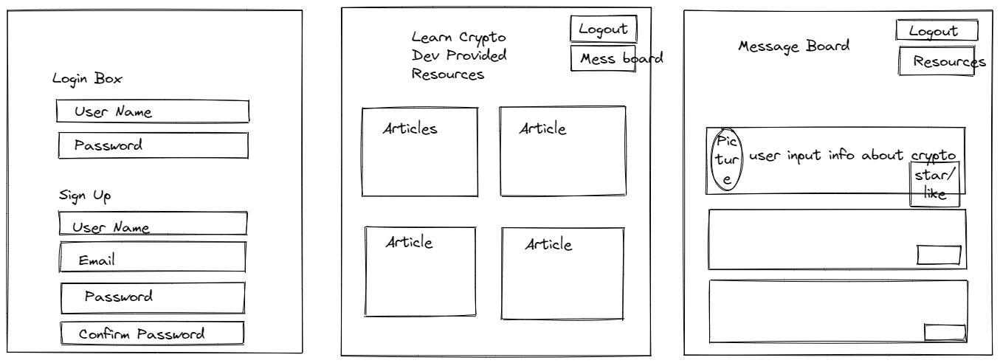

## Project 2 | Group 4

## 💲 LEARNING CRYPT 💲

1. [Description](#description)
2. [User Story](#user-story)
3. [Acceptance Criteria](#acceptance-criteria)
4. [Github Repository](#github-repository)
5. [Gitignore](#gitignore-details)
6. [Mock Up](#mock-up)

## Description

The task is to create a restful API / full stack application. This application should utilize node.js, express.js, handlebars, SQL, Sequelize, GET / POST routes, a new library (e.g. npm), and authentication in its development.

## User Story

AS A USER I want to be able to create a profile, view articles and userboard
SO THAT I can educate myself about cryptocurrencies

## Github Repository

    https://github.com/Wolfe-Nate/Learning-Crypt-Dev

## Gitignore Details

    .env
    DS_Store
    node_modules

## Mock Up

