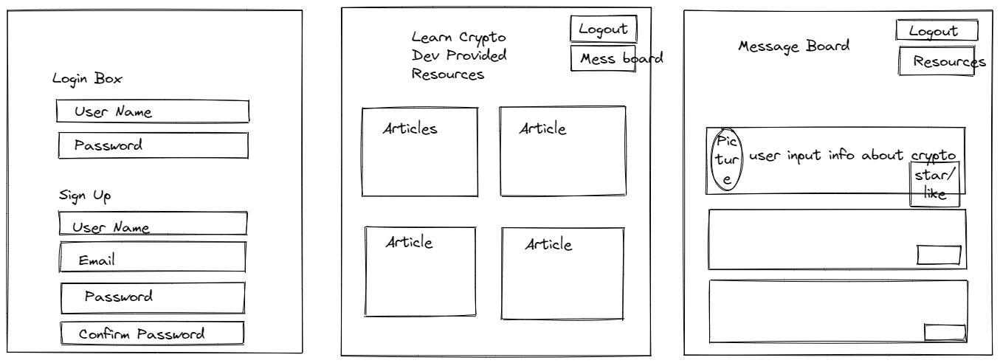

## Project 2 | Group 4 | Crypt Keepers

## 💲 LEARNING CRYPT 💲

1. [Description](#description)
2. [User Story](#user-story)
3. [Acceptance Criteria](#acceptance-criteria)
4. [Github Repository](#github-repository)
5. [Heroku Deployment](#heroku-deployment)
6. [Gitignore](#gitignore-details)
7. [Mock Up](#mock-up)
8. [Technical Aspects](#technical-aspects)
9. [Team Members](#team-members)
10. [Resources](#resources)

## Description

The world of cryptocurrencies is diverse and becoming more and more popular. But what is it? And why use it? Come learn crypt with us! Join our community by creating a user profile to gain access to message boards and handy articles to help you understand this alternative form of payment better. 💸

## User Story

AS A USER I want to be able to create a profile, view articles and userboard
SO THAT I can educate myself about cryptocurrencies

## Acceptance Criteria

The task is to create a restful API / full stack application. This application should utilize node.js, express.js, handlebars, SQL, Sequelize, GET / POST routes, a new library (e.g. npm), and authentication in its development.

## Github Repository

    https://github.com/Wolfe-Nate/Learning-Crypt-Dev

## Heroku Deployment

    https://thawing-mesa-35152.herokuapp.com

## Gitignore Details

    .env
    DS_Store
    node_modules

## Mock Up

## Technical Aspects

    ✩HTML
    ✩CSS
    ✩Javascript
    ✩HandleBars
    ✩jQuery
    ✩mySQL
    ✩Session Storage
    ✩Heroku Deployment
    ✩Materialize

## Team Members

    ✩Nate Wolfe✩
    ✩Keith MacNeil✩
    ✩Ryan Brisch✩
    ✩Rachel Kincaid✩

## Resources

https://coinmarketcap.com/alexandria/glossary

https://blog.goodaudience.com/cryptocurrency-vocabulary-37fbdd7a3adb

http://coingecko.com

http://coinmarketcap.com
